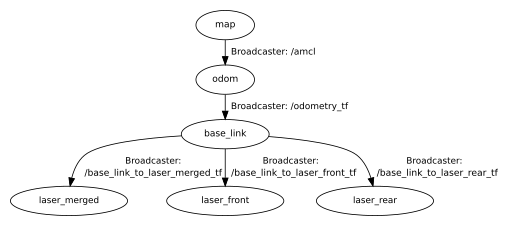

# Robotics Project 2 - A.Y. 2021-2022
Second project of the Robotics Course (Perception, Localization and Mapping for Mobile Robots) at Politecnico di Milano.  
Description of the project available [here](docs/Project2.pdf).  
The first bag has been used for mapping and the other two for localization and path generation.

## Team members
- Pablo Martellucci
- Matteo Pierini
- Sara Vignali

## Required packages
- ira_laser_tools
- gmapping
- amcl
- map_server

## ROS assets
### Nodes
- **odometry_tf** ([*odometry_tf.cpp*](src/odometry_tf.cpp))  
It broadcasts the TF for the robot base link, starting from the odometry on the */odom* topic.
- **path_generation** ([*path_generation.cpp*](src/path_generation.cpp))  
It saves all the poses received from the amcl localization (*/amcl_pose* topic) as a path, which it publishes on the */amcl_path* topic. If it has been launched specifying a map folder as an argument, it also provides the */save_path* service.

### Launch files
- [**run.launch**](launch/run.launch)  
It starts the odometry_tf node and broadcasts the three static TF from *base_link* to *laser_front*, *laser_rear* and *laser_merged*. It starts the laserscan_multi_merger node from the ira_laser_tools package to merge the two scans on the */merged_scan* topic.
- [**mapping.launch**](launch/mapping.launch)  
It launches the same nodes of *run.launch* and it creates a map of the environment from the merged scan using slam_gmapping from the gmapping package.
- [**localization.launch**](launch/localization.launch)  
It launches the same nodes of *run.launch*, plus the path_generation node and the map server, that provides the map ([map.yaml](maps/map.yaml)) from the maps folder. It performs localization using amcl (Adaptive Monte Carlo localization algorithm) and the map provided by the map server.

### Services
The ***save_path*** service (provided by the path_generation node) saves a copy of the map with the path of the robot. As specified in the [SavePath.srv](srv/SavePath.srv) service description, it does not need any input argument. It saves the map with the path as *map_with_path.png*, in the folder specified as argument of the path_generation node. If the node has been launched using the [*localization.launch*](launch/localization.launch) file, the selected folder is [project2/maps/](maps/).

### TF tree
The structure of the TF tree is reported below. The TF from *map* to *odom* is provided by the amcl node, the TF from *odom* to *base_link* is constantly updated by the odometry_tf node and the other three (from *base_link* to the three laser frames) are static.  
